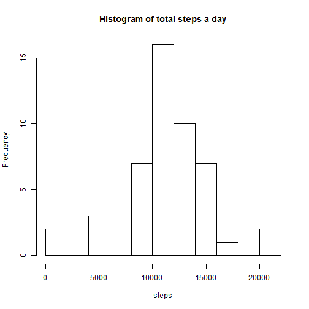
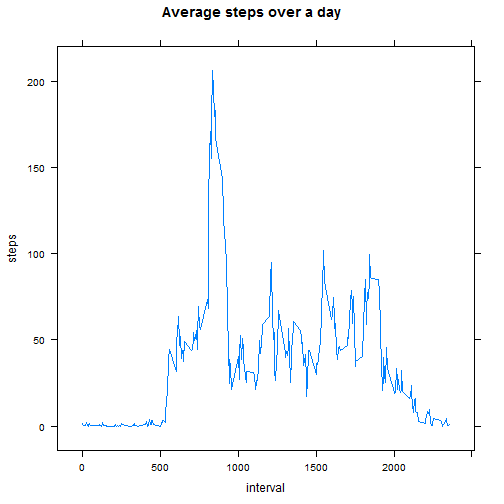
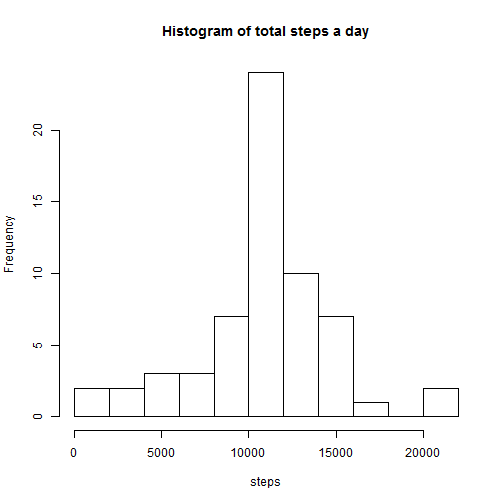
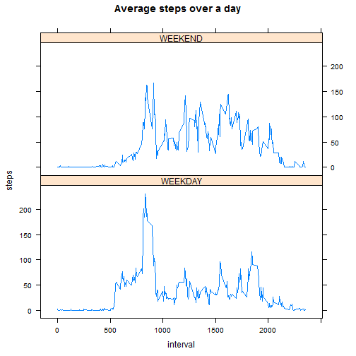

###Loading and preprocessing the data


```r
## 1. Load the data (i.e. read.csv())

##downloads and unzips the data
url <- "http://d396qusza40orc.cloudfront.net/repdata%2Fdata%2Factivity.zip"
download.file(url, "repdata-data-activity.zip", mode="wb")
unzip("repdata-data-activity.zip")

## 2.Process/transform the data (if necessary) into a format suitable for your analysis
data<-read.csv("activity.csv") ##reads it
data$date<-as.Date(data$date)  ##changes the class of the date from 'factor' to 'date'
library(plyr)
daily<-ddply(data,.(date),colwise(sum)) ##creates data frame giving total steps per day
interval<-ddply(data[,],.(interval),colwise(mean,.cols=c(1), na.rm=TRUE),.cols=c(1)) ##creates dataframe with mean steps per interval 
interval$time<-interval$interval%/%100+interval$interval%%100/60 ##adds a column converting the interval to time (in hours)
```


###What is mean total number of steps taken per day?


```r
## 1.Make a histogram of the total number of steps taken each day
hist(daily$steps,breaks="FD", main="Histogram of total steps a day", xlab="steps")
```

 

```r
## 2.Calculate and report the mean and median total number of steps taken per day
xbar<-mean(daily$steps,na.rm=TRUE)
M<-median(daily$steps,na.rm=TRUE)
paste("mean ",xbar,"   median ",M)
```

```
show [1] "mean  10766.1886792453    median  10765"
```

   
###What is the average daily activity pattern?

```r
## 1. Make a time series plot of the 5-minute interval (x-axis) and the average number of steps taken, averaged across all days (y-axis)

library(lattice) ##requires the lattice package
xyplot(steps~interval, data = interval, type='l',main="Average steps over a day")
```

 

```r
## Personally I would prefer a more logical time scale on the x-axis
## xyplot(steps~time, data = interval, type='l',main="Average steps over a day")

## 2. Which 5-minute interval, on average across all the days in the dataset, contains the maximum number of steps?
maxsteps<-interval$interval[which.max(interval$steps)]
paste("interval containg max. steps on average ", maxsteps)
```

```
show [1] "interval containg max. steps on average  835"
```


###Imputing missing values


```r
## 1.Calculate and report the total number of missing values in the dataset
missing<-sum(is.na(data$steps))
daysmissing<-sum(is.na(daily$steps))
paste("total missing values ",missing) 
```

```
show [1] "total missing values  2304"
```

```r
paste("complete days missing",daysmissing)
```

```
show [1] "complete days missing 8"
```
We can see that all the missing values are because complete days are missing.

Missing values are replaced by the mean across days for that interval.


```r
## 2.Devise a strategy for filling in all of the missing values in the dataset. 
## 3.Create a new dataset that is equal to the original dataset but with the missing data filled in.
datafilled<-data
for(i in 1:length(datafilled$steps)) {
  if (is.na(datafilled$steps[i])==TRUE) {
    datafilled$steps[i]<-interval$steps[which(interval$interval==datafilled$interval[i])]
    }
  }
```

Histogram and mean, median from the 'filled in' data


```r
## 4.Make a histogram of the total number of steps taken each day and calculate and report the mean and median total number of steps taken per day
daily2<-ddply(datafilled,.(date),colwise(sum))
hist(daily2$steps,breaks="FD", main="Histogram of total steps a day", xlab="steps")
```

 

```r
xbar2<-mean(daily2$steps,na.rm=TRUE)
M2<-median(daily2$steps,na.rm=TRUE)
paste("mean ",xbar2,"   median ",M2)
```

```
show [1] "mean  10766.1886792453    median  10766.1886792453"
```

In the histogram we can now see that all 61 days have been graphed. The days that we filled with the mean values obviously increased the frequency of the bar containing the mean.

The mean is obviously the same as previously calculated, the median is now identical to the mean (which is not so surprising as we have replaced our 8 missing days with the mean values)

###Are there differences in activity patterns between weekdays and weekends?

```r
## 1.Create a new factor variable in the dataset with two levels - "weekday" and "weekend"
datafilled$weekend<-"weekday"
for (i in 1:length(datafilled$weekend)) {
  if (weekdays(datafilled$date[i])=="Saturday"|| weekdays(datafilled$date[i])=="Sunday") {
    datafilled$weekend[i]<-"weekend"
  }
}
## 2.Make a panel plot containing a time series plot
intervalWEEKDAY<-ddply(datafilled[datafilled$weekend=="weekday",],.(interval),colwise(mean,.cols=c(1), na.rm=TRUE))
intervalWEEKDAY$time<-intervalWEEKDAY$interval%/%100+intervalWEEKDAY$interval%%100/60
intervalWEEKEND<-ddply(datafilled[datafilled$weekend=="weekend",],.(interval),colwise(mean,.cols=c(1), na.rm=TRUE))
intervalWEEKEND$time<-intervalWEEKEND$interval%/%100+intervalWEEKEND$interval%%100/60
intervalWEEKDAY$WEEKEND<-"WEEKDAY"
intervalWEEKEND$WEEKEND<-"WEEKEND"
interval2<-rbind(intervalWEEKDAY,intervalWEEKEND)
library(lattice)
xyplot(steps~interval |factor(WEEKEND), data = interval2, type='l',layout=c(1,2),main="Average steps over a day")
```

 

```r
## again using a more logical scale.
## xyplot(steps~time |factor(WEEKEND), data = interval2, type='l',layout=c(1,2))
```

We can see that on weekdays activity is reduced during working hours, but there is a peak around 8 o'clock. At the weekend activity is more evenly distributed throughout the day.


